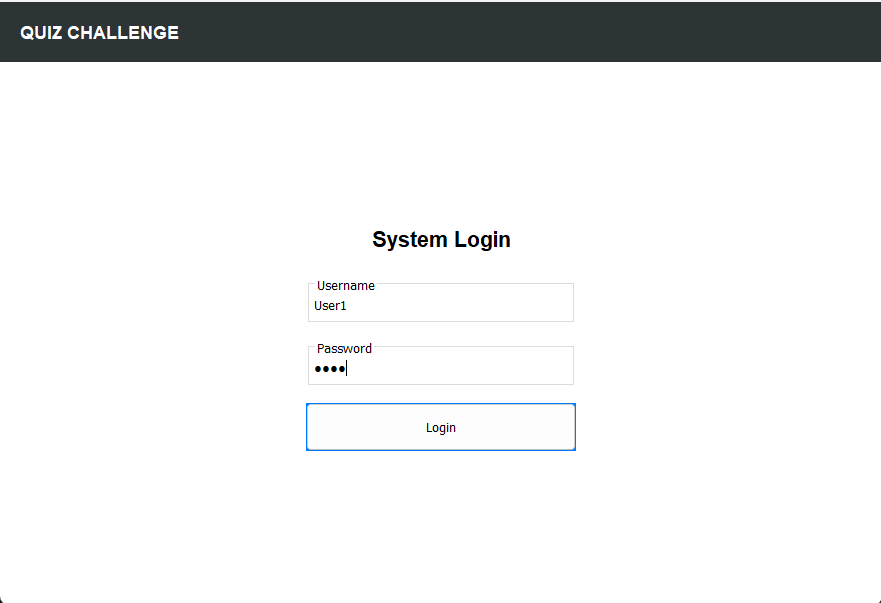
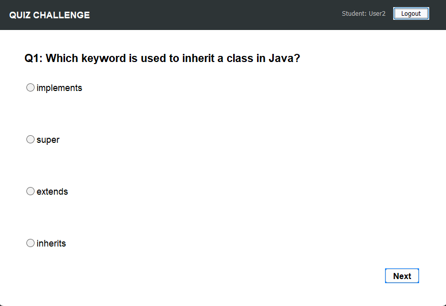
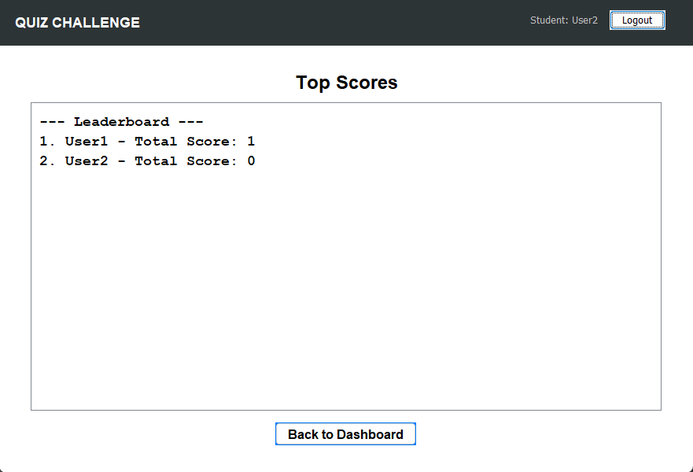

<div align="center">
  
  <h1>🧠 Quiz & Challenge System</h1>
  <p>
    <strong>A Robust Java-Based Desktop Application for Academic Assessments</strong>
  </p>

  <p>
    <a href="#-about-the-project">About</a> •
    <a href="#-key-features">Features</a> •
    <a href="#-project-architecture">Architecture</a> •
    <a href="#-tech-stack">Tech Stack</a> •
    <a href="#-how-to-run">Setup</a>
  </p>

  
  
  
  
</div>

---

## 📖 About The Project

The **Quiz & Challenge System** is a professional desktop solution designed to automate the process of creating, taking, and ranking academic quizzes. 

Built with a focus on **Object-Oriented Programming (OOP)**, the application ensures a seamless experience for both educators (Admins) and learners (Students). It eliminates the need for manual grading and provides instant feedback through a dynamic scoring engine and a real-time competitive leaderboard.

---

## 📸 Project Showcase

### 🔐 Secure Authentication
A role-based login system that distinguishes between students and administrators.
<br>

<br><br>

### 👨‍🎓 Student Dashboard & Quiz Engine
Students can launch randomized quizzes. The engine ensures distinct questions every time and provides an immersive test-taking interface with radio-button navigation.
<br>

<br><br>

### ⚙️ Admin Command Center
A powerful CRUD (Create, Read, Update, Delete) interface. Admins can load existing questions by ID, modify text/options, or wipe them from the bank entirely.
<br>

<br><br>

### 🏆 Competitive Leaderboard
A high-performance ranking system using the **Bubble Sort** algorithm to display the top performers across the platform.
<br>


---

## 🚀 Key Features

| Role | Capabilities |
| :--- | :--- |
| **Students** | • Take randomized 3-question challenges.<br>• Instant score calculation & permanent saving.<br>• View ranking on the global Leaderboard.<br>• Automated score tracking in personal history. |
| **Admins** | • Full Question Bank Management (CRUD).<br>• Search/Load questions by unique ID.<br>• Immediate disk persistence for all data changes.<br>• Default question loader for system initialization. |

---

## 🛠️ Tech Stack

* **Core Logic:** Java (JDK 8 or higher)
* **GUI Framework:** Java Swing & AWT (Single Page Architecture via `CardLayout`)
* **Data Persistence:** Native Java **Object Serialization** (No SQL setup required)
* **Algorithms:**
    * **Bubble Sort:** For leaderboard ranking.
    * **Randomization Logic:** For distinct quiz generation.
    * **Array Shifting:** For dynamic question bank cleanup.

---

## ⚙️ How to Run

1.  **Clone the repository**
    ```bash
    git clone [https://github.com/yourusername/quiz-challenge-system.git](https://github.com/yourusername/quiz-challenge-system.git)
    cd quiz-challenge-system
    ```

2.  **Compile the source code**
    ```bash
    javac *.java
    ```

3.  **Run the Application**
    ```bash
    java App
    ```
    *The system will automatically generate `SystemData.dat` to handle your data.*

---

## 🔐 Demo Credentials

| Role | Username | Password |
| :--- | :--- | :--- |
| **Admin** | `admin` | `admin` |
| **Student** | `User1` | `1234` |
| **Student** | `User2` | `5678` |
| **Student** | `User3` | `8910` |

---

* Project Date: May 2026

---
<div align="center">
  <small>OOP Project Build for University Discussion</small>
</div>
